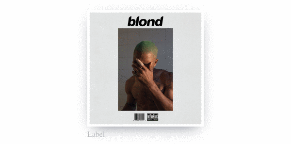

# [react-parallax-card](https://theopak.github.io/react-parallax-card)

[](https://travis-ci.org/theopak/react-parallax-card)
[](https://codecov.io/gh/theopak/react-parallax-card)
[](http://badge.fury.io/js/react-parallax-card)

React component for a card with 3D effects similar to Apple TV app icons. Work in progress. Heavily inspired by https://github.com/drewwilson/atvImg

Demo: https://theopak.github.io/react-parallax-card

```js
<ParallaxCard
  label='Label (optional)'
  enableRotate
  style={{ margin: '0 auto', width: 240, height: 240 }}>
  
</ParallaxCard>
```
